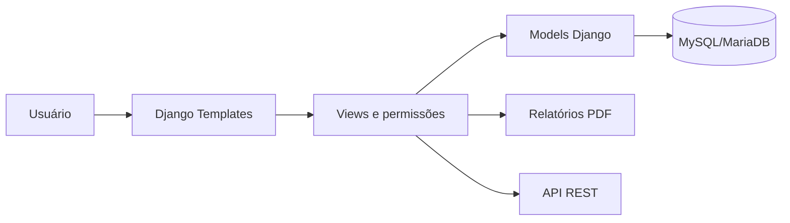

# Gestok

Sistema web de vendas, estoque e operação de caixa voltado para mercados e
pequenos comércios. A plataforma reúne controle de produtos, PDV, histórico de
vendas, movimentações de estoque, usuários, dashboard gerencial e relatórios em
PDF.

## Principais recursos

- Autenticação por matrícula e senha.
- Troca obrigatória da senha no primeiro acesso.
- Permissões definidas pelo cargo operacional.
- Dashboard gerencial de vendas e estoque.
- Cadastro, edição, ativação e inativação de produtos.
- Controle de categorias, estoque atual e estoque mínimo.
- Registro auditável de entradas, vendas, estornos e ajustes.
- Ponto de venda com abertura e fechamento diário de caixa.
- Pagamentos por dinheiro, Pix, cartão e outros.
- Histórico de vendas com filtros, detalhes e exportação em PDF.
- Histórico de fechamentos com exportação individual ou por período.
- Exportação das movimentações de estoque em PDF.
- Administração de usuários em painéis laterais.
- API autenticada para produtos e categorias.

## Stack

| Camada | Tecnologia |
| --- | --- |
| Backend | Python e Django 5 |
| API | Django REST Framework e drf-spectacular |
| Banco de dados | MySQL ou MariaDB com `utf8mb4` |
| Frontend | Django Templates, Bootstrap 5, CSS e JavaScript |
| Ícones | Material Symbols e Bootstrap Icons |
| Gráficos | Chart.js |
| PDFs | ReportLab |
| Autenticação | Modelo de usuário customizado do Django |
| Fuso horário | `America/Manaus` |

## Arquitetura

O projeto segue a organização tradicional de aplicações Django:

```text
Gestok/
|-- accounts/          # autenticação, usuários, cargos e perfil
|-- api/               # API REST de produtos e categorias
|-- cashier/           # abertura, operação e fechamento de caixa
|-- core/              # página inicial, middleware, filtros e utilitários
|-- products/          # categorias, produtos e movimentações
|-- reports/           # dashboard e relatórios de fechamento
|-- sales/             # vendas, itens, detalhes e estornos
|-- gestok_project/    # configuração e URLs principais
|-- static/            # CSS, JavaScript e imagens
|-- templates/         # templates HTML
|-- manage.py
`-- requirements.txt
```



## Requisitos

- Python 3.11 ou superior.
- MySQL 8 ou MariaDB compatível.
- `pip` e ambiente virtual Python.
- Navegador moderno.

## Instalação no Windows

1. Abra o PowerShell na pasta do projeto.

2. Crie e ative o ambiente virtual:

```powershell
python -m venv venv
.\venv\Scripts\Activate.ps1
```

3. Instale as dependências:

```powershell
python -m pip install -r requirements.txt
```

4. Crie o banco:

```sql
CREATE DATABASE gestok_db
  CHARACTER SET utf8mb4
  COLLATE utf8mb4_unicode_ci;
```

5. Crie a configuração local a partir do exemplo:

```powershell
Copy-Item .env.example .env
```

Edite o arquivo `.env` com a chave da aplicação, hosts e credenciais do seu
MySQL/MariaDB. Esse arquivo é ignorado pelo Git.

6. Aplique as migrações:

```powershell
python manage.py migrate
```

7. Crie o primeiro gerente:

```powershell
python manage.py createsuperuser
```

8. Inicie a aplicação:

```powershell
python manage.py runserver
```

9. Acesse:

```text
http://127.0.0.1:8000/
```

## Primeiro acesso

Usuários cadastrados pela interface recebem:

- Matrícula numérica gerada automaticamente.
- Senha inicial `senha123`.
- Obrigação de cadastrar uma nova senha no primeiro login.

Depois da autenticação, cada cargo é enviado para sua página inicial:

| Cargo | Página inicial |
| --- | --- |
| Gerente | Dashboard |
| Atendente | Minhas Vendas |
| Estoquista | Produtos |

> A senha inicial deve ser usada apenas no ambiente controlado de implantação.
> Em produção, substitua esse processo por uma senha temporária aleatória ou um
> fluxo seguro de ativação.

## Permissões

As permissões são derivadas do campo `cargo`. O usuário não escolhe um perfil
de acesso separado.

| Recurso | Gerente | Atendente | Estoquista |
| --- | :---: | :---: | :---: |
| Dashboard | Sim | Não | Não |
| Todas as vendas | Sim | Não | Não |
| Próprias vendas | Sim | Sim | Não |
| Operar caixa/PDV | Sim | Sim | Não |
| Ver próprios fechamentos | Sim | Sim | Não |
| Ver fechamentos de todos | Sim | Não | Não |
| Movimentações de estoque | Sim | Sim | Não |
| Produtos | Sim | Não | Sim, somente consulta |
| Criar e editar produtos | Sim | Não | Não |
| Entrada/ajuste manual de estoque | Sim | Não | Não |
| Estornar vendas | Sim | Não | Não |
| Administrar usuários | Sim | Não | Não |
| Perfil próprio | Sim | Sim | Sim |

As telas usam mixins de autorização no backend. Ocultar um item do menu não é a
única proteção: o acesso direto à URL também é validado.

## Fluxo de uso

### 1. Preparação inicial

1. O gerente cria categorias.
2. O gerente cadastra os produtos, preços e estoque inicial.
3. O gerente cadastra os usuários e define seus cargos.
4. Cada usuário entra com matrícula e senha temporária.
5. No primeiro acesso, o usuário define sua senha definitiva.

### 2. Operação diária do caixa

1. O atendente entra em `Caixa / PDV`.
2. Se não houver caixa aberto no dia, o sistema exige o valor inicial de troco.
3. Um caixa antigo pendente bloqueia novas vendas até seu fechamento.
4. O operador pesquisa o produto e adiciona os itens.
5. O sistema valida o estoque disponível.
6. O operador escolhe dinheiro, Pix, cartão ou outros.
7. Ao finalizar, a venda é gravada e o estoque é baixado.
8. Uma movimentação do tipo `VENDA` é criada para cada produto vendido.
9. No fim do expediente, o operador usa `Finalizar Caixa`.
10. O sistema compara o dinheiro esperado com o valor declarado e registra a
    diferença.

### 3. Fechamentos posteriores

Na tela do Caixa, o botão `Fechamentos` abre o histórico. O gerente pode
consultar todos os operadores; o atendente visualiza apenas os próprios caixas.
É possível exportar um fechamento específico ou todo o período filtrado.

### 4. Estoque e auditoria

- Entradas e ajustes manuais são registrados pelo gerente.
- Vendas criam saídas automaticamente.
- Estornos devolvem os itens e criam movimentações de estorno.
- Cada movimentação conserva estoque anterior, estoque posterior, usuário,
  horário e observação.
- Produtos inativos permanecem no catálogo para preservar o histórico.

## Identificadores gerados

| Registro | Formato |
| --- | --- |
| Produto | `GST-000001` |
| Movimentação | `MOV-000001` |
| Venda | `VEN-000001` |
| Usuário | Matrícula numérica sequencial |
| Caixa | ID numérico do banco |

## Relatórios e exportações

### Vendas

A tela `Minhas Vendas` permite filtrar por:

- Número da venda, vendedor ou matrícula.
- Status.
- Data inicial.
- Data final.

O PDF respeita os mesmos filtros e contém registros, valores, status, formas de
pagamento e resumo financeiro. Atendentes exportam somente suas vendas.

### Movimentações

A tela de movimentações filtra por:

- Produto, SKU, código da movimentação ou usuário.
- Tipo de movimentação.
- Data inicial e final.

O PDF inclui estoque anterior e posterior, quantidades, usuário, observações e
um resumo por tipo.

### Fechamento de caixa

O relatório inclui:

- Operador, abertura e fechamento.
- Valor de abertura.
- Totais por forma de pagamento.
- Valor esperado em dinheiro.
- Valor declarado.
- Diferença de fechamento.
- Observação e vendas relacionadas.

## Rotas principais

### Acesso e usuários

| Rota | Finalidade |
| --- | --- |
| `/accounts/login/` | Login por matrícula |
| `/accounts/primeiro-acesso/` | Definição da primeira senha |
| `/accounts/profile/` | Perfil do usuário atual |
| `/accounts/change-password/` | Alteração de senha |
| `/accounts/users/` | Administração de usuários |
| `/accounts/users/new/` | Cadastro de usuário |
| `/accounts/users/<id>/` | Visualização do usuário |
| `/accounts/users/<id>/edit/` | Edição do usuário |

### Produtos e estoque

| Rota | Finalidade |
| --- | --- |
| `/products/` | Lista de produtos |
| `/products/new/` | Cadastro de produto |
| `/products/<id>/edit/` | Edição de produto |
| `/products/categories/` | Categorias |
| `/products/movements/` | Movimentações de estoque |
| `/products/movements/pdf/` | PDF das movimentações filtradas |
| `/products/inventory-entry/` | Entrada ou ajuste manual |

### Vendas

| Rota | Finalidade |
| --- | --- |
| `/sales/my-sales/` | Histórico de vendas |
| `/sales/my-sales/pdf/` | PDF das vendas filtradas |
| `/sales/<id>/` | Detalhes da venda |
| `/sales/<id>/estorno/` | Estorno administrativo |

### Caixa

| Rota | Finalidade |
| --- | --- |
| `/cashier/` | Ponto de venda |
| `/cashier/abrir/` | Abertura do caixa |
| `/cashier/fechar/` | Fechamento do caixa |
| `/cashier/fechamentos/` | Histórico de fechamentos |
| `/cashier/adicionar-item/` | Adição de item à venda |
| `/cashier/atualizar-item/<id>/` | Alteração de quantidade |
| `/cashier/remover-item/<id>/` | Remoção de item |
| `/cashier/finalizar-venda/` | Finalização da venda |
| `/cashier/cancelar-venda/` | Cancelamento da venda aberta |

### Dashboard e relatórios

| Rota | Finalidade |
| --- | --- |
| `/reports/dashboard/` | Dashboard gerencial |
| `/reports/fechamento/` | Resumo administrativo de fechamento |
| `/reports/fechamento-caixa/pdf/` | PDF de fechamento |
| `/reports/fechamento-caixa/csv/` | CSV de fechamento |

### API

| Rota | Finalidade |
| --- | --- |
| `/api/categories/` | API de categorias |
| `/api/products/` | API de produtos |

Na API, usuários autenticados podem consultar. Operações de escrita exigem
perfil administrativo.

## Modelos de dados centrais

- `CustomUser`: matrícula, nome, contato, endereço, cargo e estado do acesso.
- `Category`: categoria ativa ou inativa.
- `Product`: preços, categoria, estoque atual, estoque mínimo e situação.
- `InventoryMovement`: trilha de auditoria de cada alteração de estoque.
- `Sale`: cabeçalho, vendedor, caixa, pagamento, valor e status.
- `SaleItem`: produto, quantidade, preço unitário e subtotal.
- `CashRegister`: abertura, fechamento, valores esperado/declarado e diferença.

Os relacionamentos históricos importantes usam proteção contra exclusão para
evitar que produtos, operadores ou caixas associados desapareçam.

## Testes

Execute toda a suíte:

```powershell
python manage.py test
```

Os testes cobrem autenticação, primeiro acesso, cargos, formulários laterais,
endereços, abertura e fechamento de caixa, isolamento por operador, filtros e
exportações em PDF.

## Configuração para produção

Antes de publicar o Gestok:

1. Defina uma `GESTOK_SECRET_KEY` longa e aleatória.
2. Desative `DEBUG`.
3. Restrinja `ALLOWED_HOSTS`.
4. Configure as variáveis de banco sem versionar o arquivo `.env`.
5. Use um servidor WSGI de produção.
6. Configure HTTPS, arquivos estáticos e backups.
7. Troque a senha inicial fixa por credenciais temporárias aleatórias.
8. Revise logs, auditoria, política de senhas e permissões da API.
9. Crie uma restrição de banco para impedir caixas simultâneos por operador,
   caso a aplicação seja executada em múltiplos servidores.

## Comandos úteis

```powershell
# Verificar configuração
python manage.py check

# Criar migrações
python manage.py makemigrations

# Aplicar migrações
python manage.py migrate

# Criar gerente
python manage.py createsuperuser

# Rodar testes
python manage.py test

# Iniciar servidor
python manage.py runserver

# Regenerar o resumo da plataforma em PDF
python docs/generate_platform_summary.py
```

## Estado atual

O Gestok está estruturado como uma aplicação operacional funcional para ambiente
de mercado. O foco atual é uso local ou em rede controlada. As recomendações da
seção de produção devem ser aplicadas antes de exposição pública.
